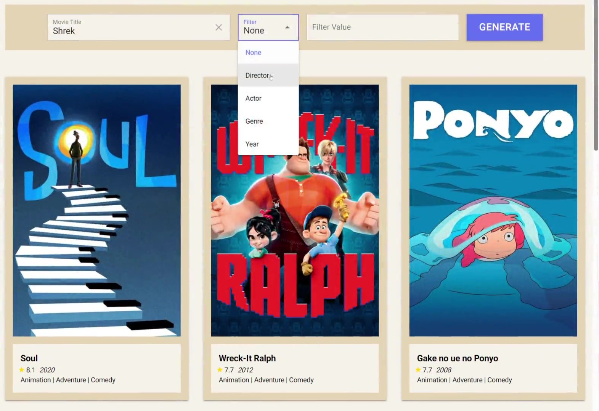
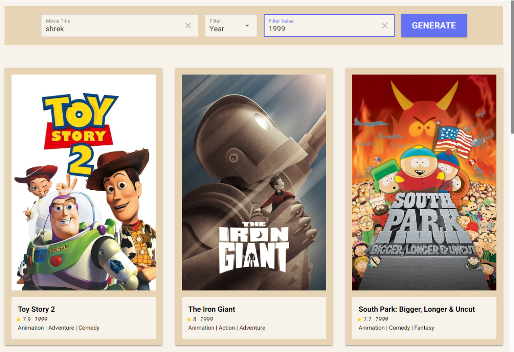

# Project: Machine Learning Movie Recommender

## Description

In this project, I built a movie recommender that takes a movie title as input and
outputs 9 movies that are most similar to it. The user also has the option to include either a
director name, actor name, genre, or release year along with the movie title in their search. The
user inputs the movie title and optional filter in a graphical user interface, and the input is then
passed to the model, which returns the output and displays it on the same interface. The model
returns the movie titles, and on the user interface we added additional details about each movie,
along with a poster of the movie. I used a Kaggle dataset of the top 1000 IMDB movies, and
vectorized information about each movie in order to compare them.

  
  

## Repo Layout
#### The `data` folder contains the raw data in the form of a CSV file
#### The `src` folder contains all the code for the project
- `main.py` is the driver of the project that runs the GUI. Run this file to run the program.
- `curate_data.py` holds the functions that cleaned the raw data.
- `model.py` contains the model functions. 

## Required Libraries
- Pandas
- Numpy
- Nicegui
- Requests
- Pywebview
- Scikit-learn

#### References
- https://www.datacamp.com/tutorial/recommender-systems-python
- https://techvidvan.com/tutorials/movie-recommendation-system-python-machine-learning/
- https://towardsdatascience.com/basics-of-countvectorizer-e26677900f9c
- https://scikit-learn.org/stable/modules/generated/sklearn.feature_extraction.text.CountVectorizer.html
- https://stackoverflow.com/questions/22586741/python-storing-a-large-matrix-into-a-text-file-for-later-usage

